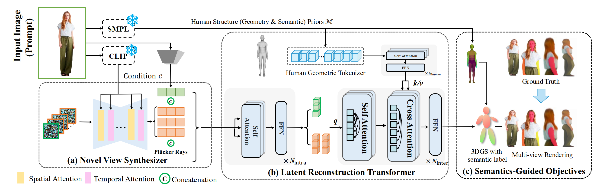
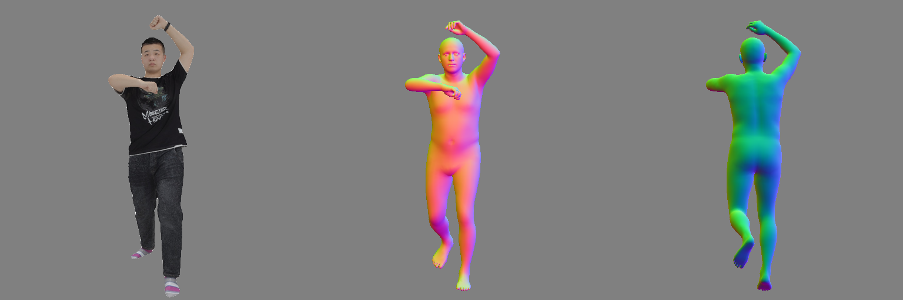

<div align="center">

<h1>&#128293;  HumanSplat: Generalizable Single-Image Human
Gaussian Splatting with Structure Priors</h1>

 [](https://arxiv.org/abs/2406.12459)  [](https://humansplat.github.io/) [](https://github.com/humansplat/humansplat) [](./LICENSE)

<!-- <video> 
   <source src="https://github.com/humansplat/humansplat/raw/refs/heads/main/data/assets/humansplat.mp4" type="video/mp4">
</video> -->




<strong> HumanSplat predicts 3D Gaussian Splatting properties from a single input image in a generalizable manner.</strong>
<!-- --- -->
</div>


### 📊  Dataset
Download human datasets ([Thuman2.0](https://github.com/ytrock/THuman2.0-Dataset), [2K2K](https://github.com/SangHunHan92/2K2K) and [Twindom](https://web.twindom.com/)) and organize them as follows:
```bash
${ROOT} 
├──📂data/
    ├──📂Thuman2/
       ├── 📂0000/
       ├── 📂...
       ├── 📂0525/
    ├──📂2K2K/
       ├── 📂00003/
       ├── 📂...
       ├── 📂04739/
    ├──📂Twindom/

```

### 🔧  Installation

(1) Register an account and run `bash settings/fetch_hps.sh` 
#### Register an username & password for [pixie](https://pixie.is.tue.mpg.de/index.html) and [SMPLX](https://smpl-x.is.tue.mpg.de/index.html)  is required.

```bash
bash settings/fetch_hps.sh
```


(2)Additionally install dependencies and setup the environment:
```bash
bash settings/setup.sh
```

####  HPS (Human Pose and Shape) Estimation
<details>
<summary> 🚀 HPS Usage</summary>


```bash
# init revebg, load pretrained models, and predict HPS
python3 src/predit_hps.py
```


</details>

## 🚀 Usage
### 

The code has been recently tidied up for release and could perhaps contain bugs. Please feel free to open an issue.


## 📚 Citation
 If you find our work useful for your research, please consider citing and starring the repo ⭐. Thank you very much.
```bibtex
@article{pan2024humansplat,
  title={HumanSplat: Generalizable Single-Image Human Gaussian Splatting with Structure Priors},
  author={Pan, Panwang and Su, Zhuo and Lin, Chenguo and Fan, Zhen and Zhang, Yongjie and Li, Zeming and Shen, Tingting and Mu, Yadong and Liu, Yebin},
  journal={arXiv preprint arXiv:2406.12459},
  year={2024}
}
```


